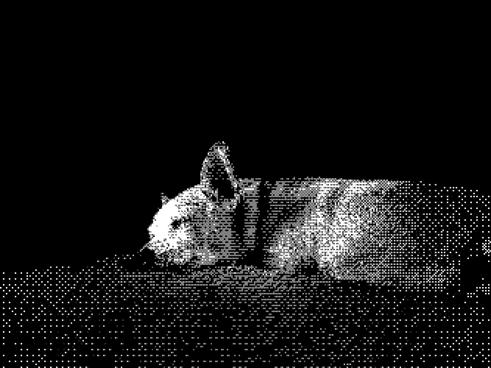

Mi querido vic:

Me siento estúpidamente feliz de tenerte aquí a mi lado, jugando sobre tu cama, tratando de morder una pelota de pickleball y, cada cierto tiempo, ladrándome para exigirme que te la aviente.  
Te acabo de quitar la venda que traías en tu pata izquierda, donde te canalizaron. Hoy fui a recogerte porque ayer te quedaste hospitalizado.

{ Me pides un paseo, así que vamos y regreso a escribir }

El viernes caímos muy temprano. Te di tus medicamentos con la cena, pero no me aseguré de que los tomaras; me sentía muy cansado.
A las 3 de la mañana despertamos, bajamos al patio a que hicieras chis. Hacía frío. Me puse a escribir un rato y, celoso, competías por caricias.
Volvimos a dormir un rato; oficialmente nos paramos a las 6 para tu paseo y regresamos a echar la flojera viendo tele.
Hizo efecto el Tradea, acomodamos el cuarto y empecé a subir los libros que tenía en el piso de abajo, varios viajes. Primero me seguiste y después ya no; no se me hizo extraño.
De repente te vi: empezaba una convulsión. Me senté a tu lado, te acomodé en tu cama y la sobrellevamos juntos.
No me había percatado del tiempo: estábamos atrasados para el desayuno y la medicina.
Bajamos y no los querías; a veces te pones difícil y es un rollo dártelos. Usé mermelada, te serví un poco de leche y vino la segunda convulsión, en mis brazos.

El medicamento iba a hacer efecto, pero cambiaron los planes: saldrías con nosotros para tenerte vigilado.

{ Te subo a mis piernas, me entumo, pero te tranquiliza }

Me bañé rápido; olvidaba la cita de mamá a las 9. Preparé tus cosas y agarramos camino.
A mitad de trayecto, otra convulsión: sobre tu cama en el asiento de atrás. Me puse nervioso, pero no te harías daño; tenía que estar atento al camino.
Inmediatamente otra; esta vez te caíste y le pedí a M que te acomodara.
Llegamos a destino, la cita para una radiografía. Me estacioné y me pasé atrás contigo, para acompañarte y acariciarte.
La siguiente parada sería emergencias, a menos de un kilómetro. Vomitaste la leche y las pastillas. Otra convulsión, una más, y otra, cada vez más fuertes y seguidas.  

No tardamos en llegar al consultorio; nos recibieron y, en el interrogatorio, tuviste de nuevo convulsiones. Pesaste 4.8 kg. La pata derecha no funcionó. Te puncionaron la vena, empezaron a administrar medicamentos, aunque no parecían funcionar. Te envolvimos como taco y, aun así, no lograbas tranquilizarte. Te hablaba bajito, te besaba. Tú gritabas, aullabas y ladrabas, demasiado fuerte. Te retorcías, forcejeabas y me arañabas. Después me sentí molido de tanto esfuerzo.
Llegó tu doctora, J. Te tomó de mis brazos y te llevó a otro lado. Salí a sentarme; tenía unas inmensas ganas de llorar. Estaba ajeno a todo, fuera de mí... me sentía una mierda. Es mi culpa, se repetía miles de veces en mi cabeza.  

Unos minutos después me dijeron que te quedarías en observación. Firmé papeles, pagué cosas, me mandaron por el resto de tus medicamentos. Anestesiado, distraído, con dolor de cabeza, manejé e hice el resto de las actividades del día. ¿Almuerzo? ¿Compras?
Soy una mierda. Es mi culpa, se repitió millones de veces en mi cabeza.

En enero cumples 13 años. Yo sé que no he sido el mejor compañero, pero para ti siempre he sido tu persona; a nadie amas como a mí.
¿Cómo cuidarte si a veces no puedo conmigo? Lo siento mucho.
La pandemia fue terrible, pero hubo algunas oportunidades, algunas cosas buenas que pasaron. Una de ellas nos sucedió a nosotros: te subí a mi cuarto, a mi cama, te volviste mi compañía 24/7 y el mundo cambió para ambos. Dejaste de ser perro de zotehuela; yo empecé a ser más feliz.

Me has cambiado la vida. No hay otro ser que me dé lo que tú sí.
Te amo con todas mis fuerzas y lo demostraré procurándote siempre, con todo mi ser.

{ Ahora haces berrinche, llevo demasiado tiempo en la computadora }