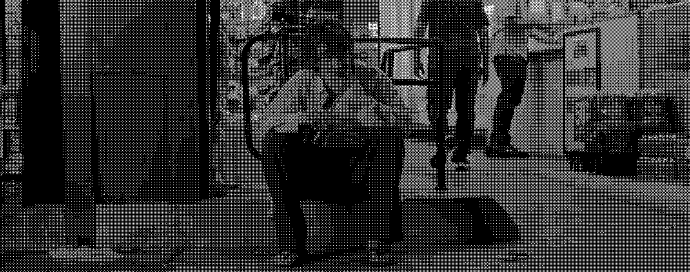

import ChatBubble from '@/components/ui/ChatBubble.astro'

A veces no sé cómo responder a esa pregunta.

<ChatBubble 
  messages={[
    { sender: 'left', text: 'Hola, ¿Cómo estás?' }
  ]}
/>

Me incomoda. Y creo que es por tres motivos posibles:

1. **No te interesa.**  
Quieres algo de mí, pero no lo dices. Abres con una cortesía que sólo estorba para llegar al punto.

2. **No quieres saber.**  
Preguntas por tu tranquilidad; esperas que te mienta.

3. **No lo soportarías.**  
Te interesas en mi, pero si respondo con honestidad te preocuparías. No quiero cargar con eso.

<ChatBubble 
  messages={[
    { sender: 'left', text: 'Hola, ¿Cómo estás?' },
    { sender: 'right', text: '¡Bien! ¿y tú?' }
  ]}
/>

---

<ChatBubble 
  messages={[
    { sender: 'left', text: 'Para mi el mejor desaire es el silencio.' },
  ]}
/>

---

Estos días me siento como **[Loser de Tame Impala](https://youtu.be/s3a4OQR-10M?si=-3eGKXMglOibyOzt)**.

