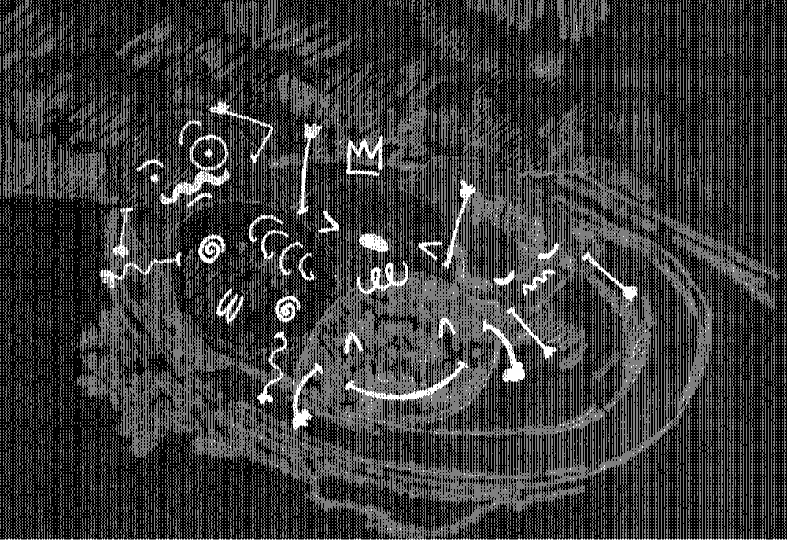

> TODO LO QUE AQUÍ SE CUENTA
> ESTÁ RIGUROSAMENTE INVENTADO,
> AUNQUE SEA VERDAD.[^1]

1887, **Vincent Van Gogh** experimenta con óleo diluido casi por completo: *peinture à l'essence*. La "naturaleza muerta"[^2] [***Schotel met citrusvruchten***](https://www.vangoghmuseum.nl/en/collection/s0193V1962) permanece en el apartamento de su hermano **Theo** hasta su muerte en 1891.

Es la tercera vez en dos días que intento subirme a un avión para ir a ver a mi hermano, las primeras dos veces con destino al Aeropuerto de Tijuana que al estar cubierto de niebla suspende operaciones. Esta vez me dirijo a LAX. El vuelo demorado, mi ser terriblemente agotado y en mi mochila, un regalo: mi versión, no diluida, muy colorida (aunque no lo parezca), anti-natural y medio animada de ***Unos limones en un plato***.

[^1]: Pérez, J. C. (2024). Cartas a Vincent (Libros del Zorro Rojo) ISBN 978-84-128041-5-7.
[^2]: ¡Qué termino tan delicioso! Lo *vivo sin vida*.