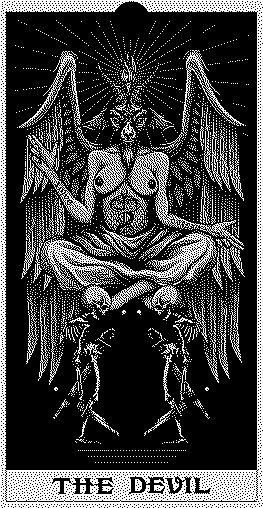

¿Y si estuviera poseído? Tengo que empezar a buscar otro tipo de explicación a todo esto que siento. No parece que tenga el control de mi cuerpo y por momentos tampoco de mis acciones, como si algo más estuviera al volante. Siento que me ahogo, que arde mi cuerpo, cansancio que es más dolor. Angustia, el movimiento constante de mi cuerpo, el temblor de mis manos y los _entes_. Esos que me susurran al oído, que resuenan en mi cabeza con las ideas más terribles.

¿Cuál es la meta de un demonio al hacer de tu cuerpo su guarida? Quebrarte y alimentarse de ti, supongo, ¿demostrar que el _mal_ está presente? ¿Y si no creo en dios? Sé que hay gente que comete atrocidades, pero creo que el grueso no es ni bueno ni malo, solo tomamos decisiones y a veces la consecuencia de estas es hacer daño. Dos opciones: o estoy ante el demonio más imbécil o solo uno hambriento, con necesidad nutricional, que disfruta poner a prueba mi resistencia.

No está de más, la próxima vez que pase junto a un templo, tocaré discretamente alguna de sus reliquias, encenderé incienso o sumergiré mi mano en su agua bendita. Como dicen, por cualquier cosa.

