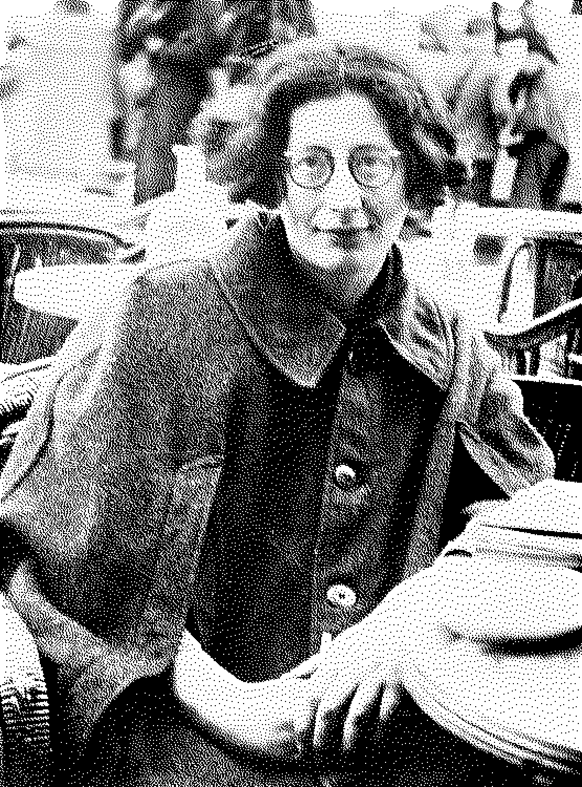

En 1942 [Simone Weil](https://es.wikipedia.org/wiki/Simone_Weil) escribió el ensayo [*L’amour de Dieu et le malheur*](https://fr.wikisource.org/wiki/Attente_de_Dieu/L%E2%80%99Amour_de_Dieu_et_le_malheur) donde describe un fenómeno distinto al "simple" sufrimiento: específico, irreductible, que se apodera del ser (ella usa *alma*) y lo marca hasta el fondo. Se acompaña de dolor, degrada socialmente; como parásito que consume y somete a la oscuridad a la persona.

Es un texto cargado de ideas religiosas, espirituales y morales, cosas que no comparto. Pero no me queda duda de que Simone sufría y trató de racionalizar su sentir. Ella buscaba alivio en su fe. Yo también trato de entender, por eso la leí y voy a retomar su texto y **vandalizarlo**.

### I. Un sufrimiento que no acabó

Yo no quiero separar *malheur* del sufrimiento y me atrevo a hacer unas correcciones. Weil dice que el dolor es una condición esencial, pero sólo habla de la duración y la frecuencia, falta hablar de la intensidad, que me parece aún más importante. 

Coincido en que el mismo acontecimiento afecta de manera diferente a cada uno. Ejemplifica la pérdida de un ser querido: *sufrimiento* es, sin duda, la palabra con que describimos el suceso. La teoría dice que existe el proceso de duelo y que eventualmente logras superar la pérdida. Pero ¿y si no?

Esa es la frontera: **un sufrimiento que no acabó**.

### II. Eso empieza a quitarme parte de lo que soy

La parte de que es anónimo y priva de tu personalidad la conecto con el factor social.

Cuando me siento mal tengo que reducir muchas partes de mi vida: las cosas que hago, las personas con las que me relaciono, los espacios que habito.

Eso empieza a quitarme parte de lo que soy. **Un sufrimiento que me despersonaliza.**

### III. Pero al mismo tiempo eres tú

¿Hay complicidad con el sufrimiento? Hace falta un análisis de la psique y la batalla dentro del individuo que sufre.

Contrario al texto, que dice que el *malheur* impide buscar los medios para ser liberado: creo que **depende del estado en el que estás.** Hay ciertos momentos en los que no quieres mejorar, incluso haces todo por estar peor.

¿Cómo obtienes energía de alguien que se consume por dentro? De este parásito que se alimenta de tu fuerza, **pero al mismo tiempo eres tú.** El sufrimiento eres tú y te consumes.

¿Qué tanto me define mi enfermedad? No poder dejar de estar mal porque tomo la identidad de alguien que está mal.

---

No puedo medirlo, ni separarlo, tampoco he logrado descubrir el camino a quitármelo. Espero que a S le haya ayudado el amor de cristo. Con esta lectura y re-interpretación de este ensayo obtengo dos cosas: que el sufrimiento tiene un extremo terrible y **que sufro de esta manera**.

