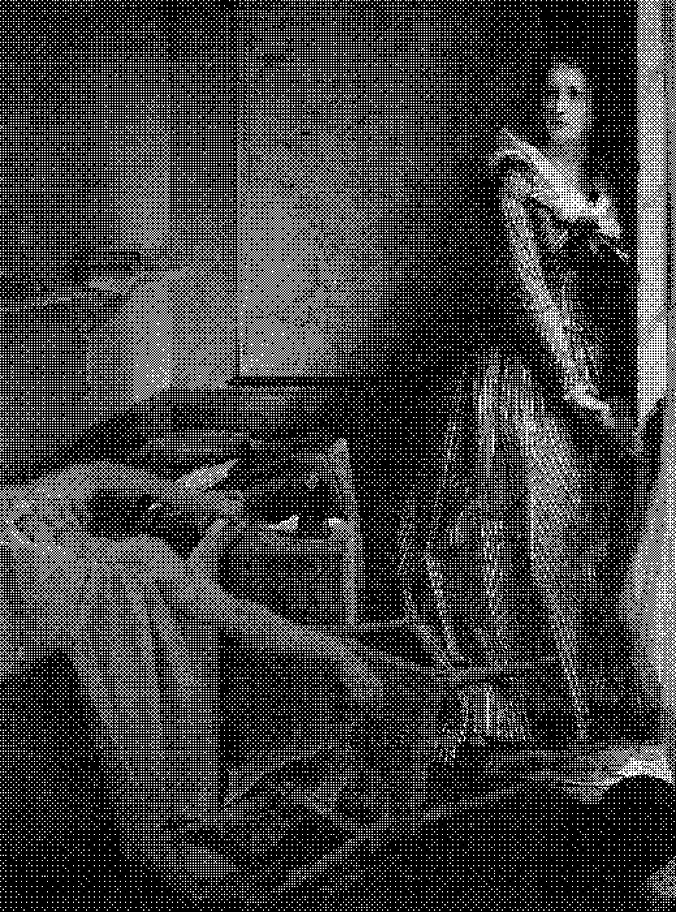

No sé si fue a propósito el pegar la faja del [número 913 de la Revista de la Universidad de México](https://www.revistadelauniversidad.mx/releases/ac358d51-a8c8-4573-a79e-79b23e443ece/cartas) para tapar el cuerpo moribundo en su portada. Quizás es el diseño de la faja, que no envuelve completamente, no sé, la cosa es que funciona muy bien. Curiosidad para saber qué hay debajo, enojo al tratar de desprender las partes con cuidado y sin romper nada; necesito la faja para ver de qué trata y necesito el espacio para apreciar la obra. Ejecución perfecta aun si fue casualidad.

[***La muerte de Marat***](https://fine-arts-museum.be/fr/la-collection/jacques-louis-david-marat-assassine), ¿por qué arde? Primero, por el objeto: la carta (no sé francés), pero la pluma, los papeles y el tintero son evidencia. Después, al despegar la faja (que ahora mismo me molesta, no regresa a su lugar): un cadáver, hombre, ¿una flecha? ¿un suicidio? extraño lugar para herirse... ¿asesinato?

Y luego la explicación, el cuadro completo, el artista y la historia. Hombre, médico, con una enfermedad incapacitante: arde aún más. Asesinato, cuchillo, pluma en mano y el nombre de la perpetradora en la carta.

¿Por qué no lo vi en mi viaje? Porque no lo estaba buscando. Ahora tengo que encontrarlo(s).

Hay una [copia en el Louvre](https://collections.louvre.fr/ark:/53355/cl010059773) con otra frase en el cajón: la copia ya es una reinvención. Y hablando de reinvenciones (porque podría hacer una lista), está la otra mitad: la heroína, Charlotte.

---

Arde porque me reflejo. Ya sé qué quiero pintar.

